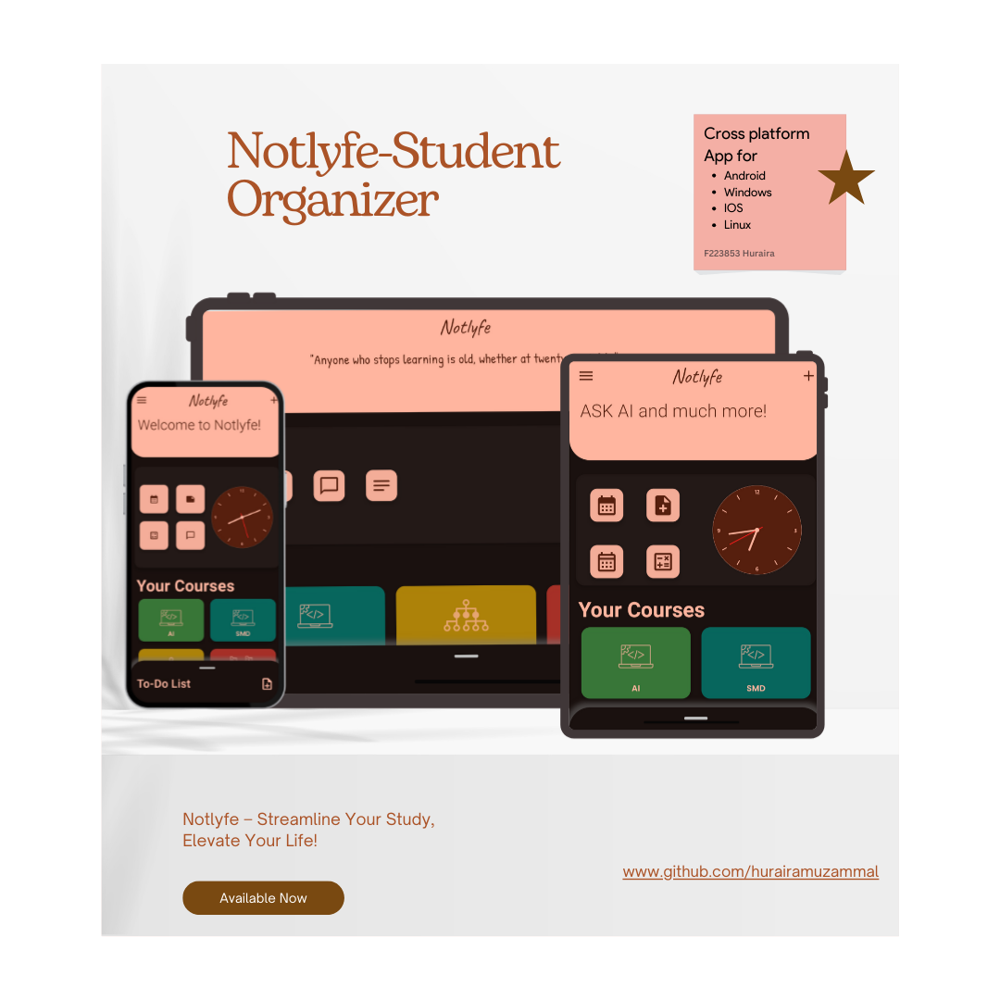

# Notlyfe-Student-Organizer🧑‍🎓  -Beta Testing ⚒️  
A Flutter app that features beautiful Material You colors. The app contains features to facilitate students in managing lecture notes and todos across multiple devices.

  

# Preview 🔍

  

# Features 🚀

* Material You Design: Enjoy a visually appealing interface with dynamic colors that adapt to your system theme.

* Cross-Device Sync: Access your notes and todos from any device, ensuring you stay organized wherever you go.

* Lecture Notes Management: Easily create, edit, and organize your lecture notes.

* Todo List: Keep track of your tasks and deadlines with a simple and intuitive todo list.

* Gemini Chatbot: With Gemini you can ask 
gemini for problem at ease.

* Calander: Todo intergrated with Calender so that students can see upcoming tasks on any day.

* CGPA Calculator: Student can calculate thier CGPA with CGPA calculator.

### Upcoming Feature ✨
* Full offline support for course todo and Notes.

* Proper data encryption

* Integration of AI model.😎

# Note ⚠️

Currently this application is in development mode therefore app lags proper data encryption.
Avoid storing sensitive info until future release.   
Flutter source code will be shared soon.😉
# About Developer  😊
This app is entirely coded by Muhammad Abu Huraira.

suggest me improvement at huraira.eqeel@gmail.com .
