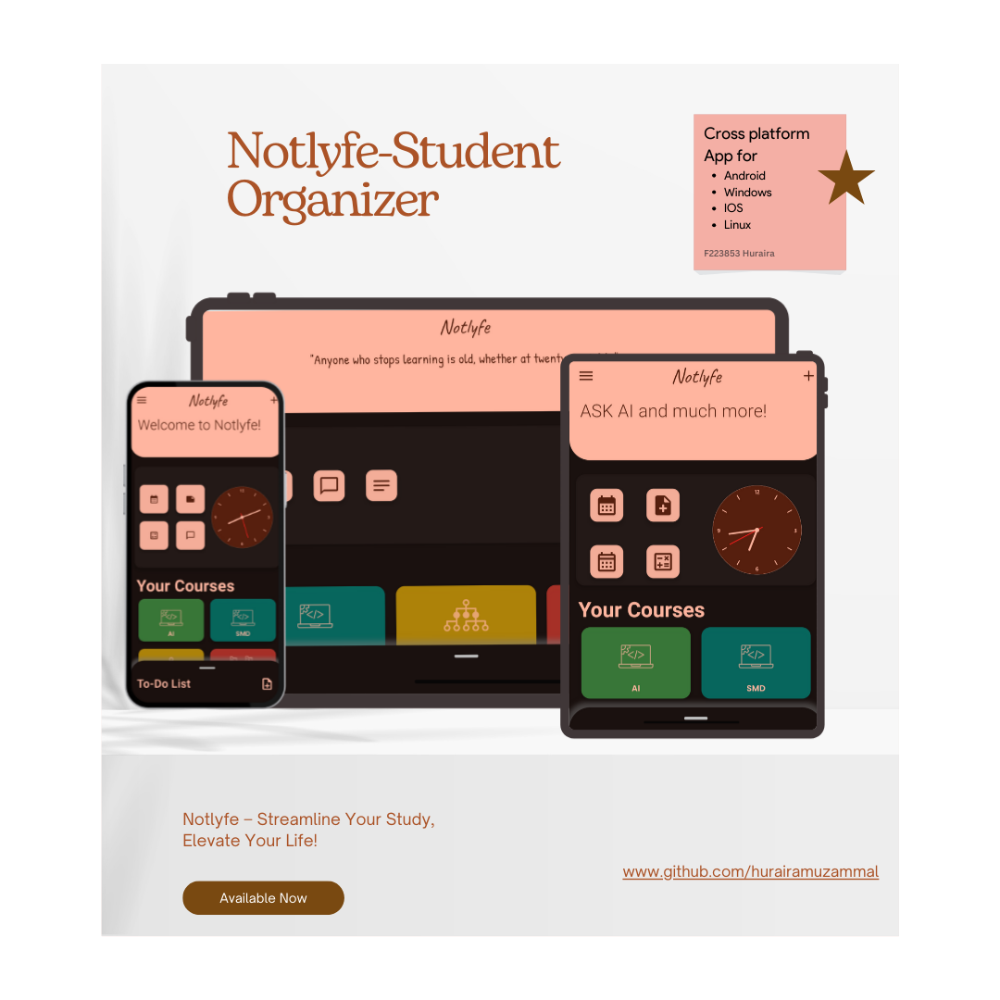
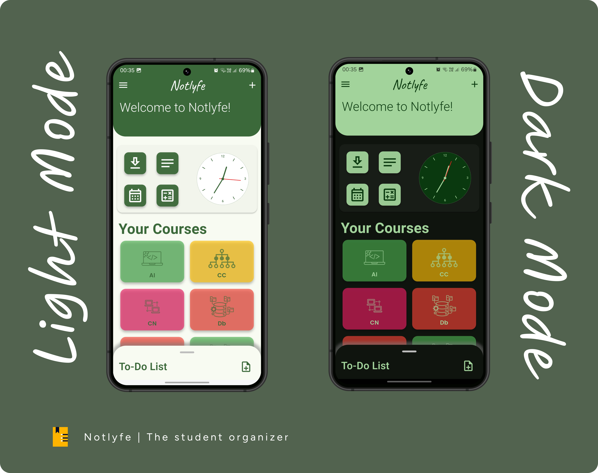
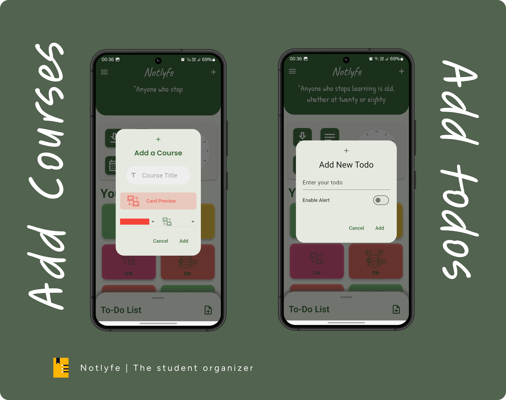
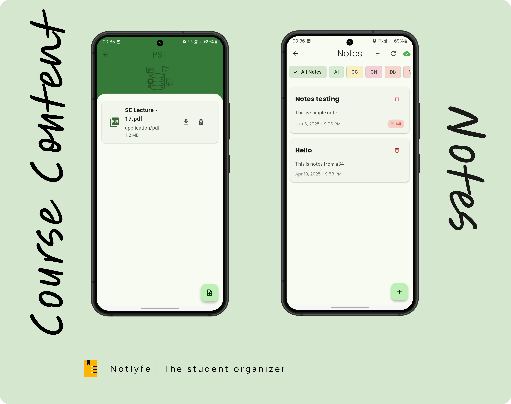
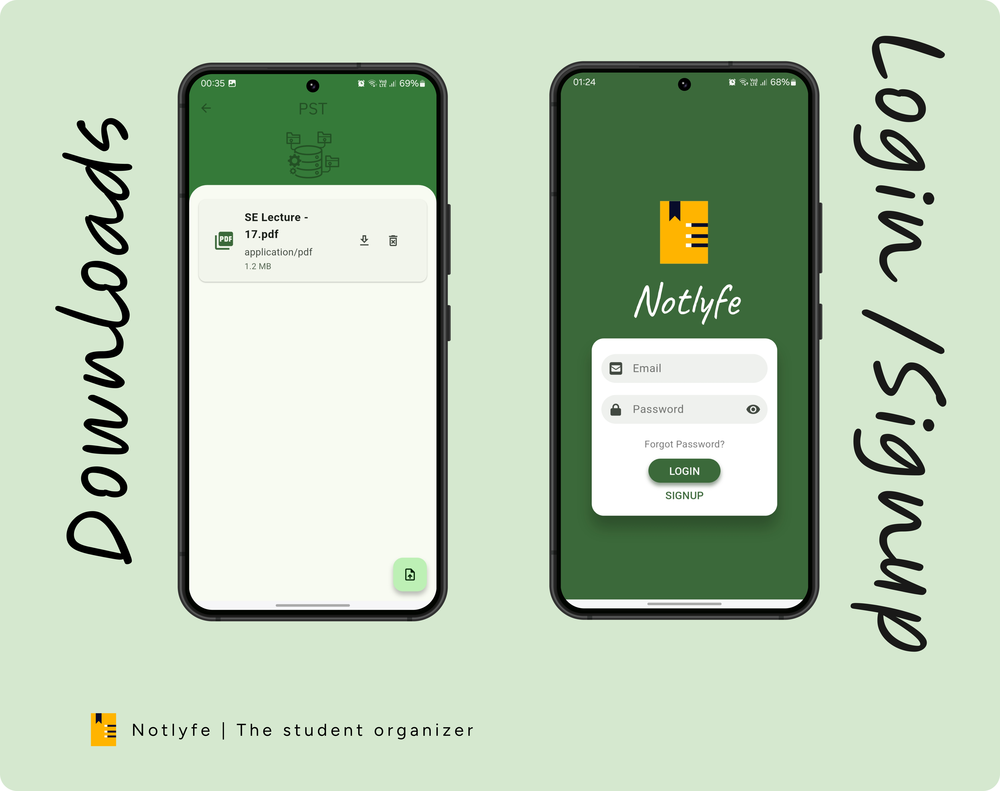

<div align="center">

# 🎓 Notlyfe — Student Organizer

**The intelligent, beautiful, all-in-one productivity suite built for modern students.**

[](https://flutter.dev)
[](https://dart.dev)
[](https://riverpod.dev)
[](https://supabase.com)
[](https://docs.hivedb.dev)
[](https://m3.material.io)
[](LICENSE)

<br/>



</div>

---

## 🌟 Overview

**Notlyfe** is an all-in-one mobile workspace designed specifically for university and college students. Balancing lectures, deadlines, course materials, GPA calculations, and daily schedules can be overwhelming. Notlyfe unites all these essential student workflows into a single cohesive experience backed by **dynamic Material You theming**, **offline-first local caching**, **cloud synchronization**, and an integrated **Gemini AI study assistant**.

---

## 🚀 Key Features

### 📚 Lecture & Course Notes Hub
- Organize notes cleanly by course code and category.
- Rich note editor with support for title, body, color tags, and search.
- Attach lecture slides, assignments, and reference documents.

### 🎯 Smart Task & Todo Tracking
- Keep track of upcoming deadlines, assignments, and project deliverables.
- Integrated directly with the timetable calendar so you never miss an exam or submission.
- Instant completion status toggles and progress indicators.

### 🤖 Gemini AI Student Assistant
- Integrated AI study companion powered by Google Gemini.
- Ask questions, get explanations for complex lecture topics, or generate study summaries on demand.

### 🎨 Material You & Adaptive Theming
- **Dynamic Seed Color Generation**: Personalize the whole application palette with an intuitive color picker.
- **Theme Appearance**: Full support for **Light**, **Dark**, and **System Default (Auto)** modes.
- **Colorful Course Cards**: Toggle high-vibrancy cards or sleek minimal styling.
- **Custom Typography**: Polished, modern typography using the Google Outfit font family.

### 📅 Islamic (Hijri) & Academic Calendar
- View Gregorian and Hijri dates side-by-side with localized month mappings.
- Plan study schedules and track exam dates with month/week/day views.

### 📊 CGPA & GPA Calculator
- Real-time semester GPA and cumulative CGPA calculation.
- Plan target grades and calculate credit hour weightings accurately.

### 📁 Document Scanner & Vault
- Scan handouts, capture whiteboard photos, and manage academic PDF files directly inside courses.

### 🔄 Dual-Layer Cloud & Offline Persistence
- **Hive NoSQL Storage**: Blazing fast offline access for notes, courses, and user settings.
- **Supabase Cloud Sync**: Real-time sync across devices with Supabase Auth, PostgreSQL, and Storage.

---

## 🖼️ Visual Showcase

<div align="center">

| Course & Task View | Study Hub & Dashboard |
| :---: | :---: |
|  |  |

| Timetable & Schedule | Notes & AI Assistant |
| :---: | :---: |
|  |  |

</div>

---

## 🎨 Design & Theming Engine

Notlyfe delivers a state-of-the-art Material 3 experience:
- **Seed-Based Palette Generation**: Uses Flutter's Material 3 algorithm (`ColorScheme.fromSeed`) to generate harmonious primary, secondary, surface, and container colors.
- **Theme Modes**: Seamlessly toggle between Light, Dark, or System Appearance.
- **Course Palette Tagging**: Pick individual accent colors for courses to recognize them at a glance.
- **Design Prototype**: Explore the interactive [Figma Prototype](https://www.figma.com/proto/v2JAgN07Si20QTaQ75721e/Software-Engineering-Project?page-id=0%3A1&node-id=2-8607&p=f&viewport=237%2C225%2C0.15&t=8BWpFacJ1jngtOZZ-1&scaling=scale-down&content-scaling=fixed&starting-point-node-id=2%3A8607).

---

## 🏗️ Technical Architecture & Stack

| Layer | Technologies & Packages |
| :--- | :--- |
| **Framework** | Flutter 3.x (Dart 3.x) |
| **State Management** | Riverpod 2.6+ (`StateProvider`, `ConsumerWidget`) |
| **Cloud Backend** | Supabase (Auth, Database, Storage) |
| **Local Storage** | Hive & Hive Flutter (NoSQL Key-Value), SQFlite |
| **Styling & Fonts** | Material 3, Google Fonts (`Outfit`), Flutter ColorPicker |
| **AI Integration** | Flutter AI Toolkit, Google Generative AI (Gemini) |
| **Utilities** | Syncfusion Calendar, Hijri, Device Preview, Connectivity Plus |

```
lib/
├── data/              # Course icons, shortcut definitions, common configs
├── database/          # Supabase queries & Hive local database managers
├── enums/             # Hijri months & app enumerations
├── models/            # Note, Course, Todo, UserProfile, AllowedColor
├── providers/         # Riverpod providers (theme, sync, notes, courses, auth)
├── screens/           # Core app screens (Notes, Tasks, AI Chat, CGPA, Settings)
├── services/          # Supabase Auth, sync managers, connectivity listener
├── theme/             # AppTheme generator, Material 3 typography, component themes
└── widgets/           # Reusable cards, custom input fields, grid views
```

---

## ⚙️ Getting Started

### Prerequisites
- [Flutter SDK](https://flutter.dev/docs/get-started/install) (v3.6.0 or later)
- [Dart SDK](https://dart.dev/get-dart) (v3.6.0 or later)
- Android Studio / VS Code with Flutter extension
- Supabase account (for cloud sync)

### Installation

1. **Clone the repository:**
   ```bash
   git clone https://github.com/hurairamuzammal/Notlyfe-Student-Oragnizer.git
   cd Notlyfe-Student-Oragnizer
   ```

2. **Install Flutter dependencies:**
   ```bash
   flutter pub get
   ```

3. **Configure Supabase Credentials:**
   Update your Supabase URL and Anon Key in `lib/main.dart` or your environment configuration:
   ```dart
   await Supabase.initialize(
     url: 'YOUR_SUPABASE_PROJECT_URL',
     anonKey: 'YOUR_SUPABASE_ANON_KEY',
   );
   ```

4. **Run the application:**
   ```bash
   flutter run
   ```

---

## 📑 Documentation

- Complete Software Requirements Specification (SRS): [View SRS PDF](Complete-Documentation/SRS-and-models.pdf)
- UI/UX Interactive Prototype: [Figma Design](https://www.figma.com/proto/v2JAgN07Si20QTaQ75721e/Software-Engineering-Project?page-id=0%3A1&node-id=2-8607&p=f&viewport=237%2C225%2C0.15&t=8BWpFacJ1jngtOZZ-1&scaling=scale-down&content-scaling=fixed&starting-point-node-id=2%3A8607)

---

## 👨‍💻 Developer & Contact

Developed with ❤️ by **Muhammad Abu Huraira**

- GitHub: [@hurairamuzammal](https://github.com/hurairamuzammal)
- Email: [huraira.eqeel@gmail.com](mailto:huraira.eqeel@gmail.com)

---

<div align="center">
  <sub>⭐ If you find Notlyfe helpful, please consider giving this repository a star!</sub>
</div>
